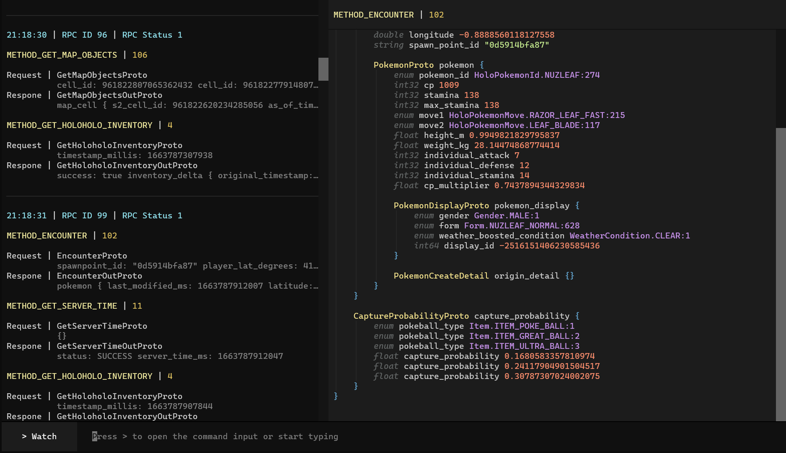

# 🚦 Traffic Light

Beautiful traffic logging for PGO. 

## Features

Traffic Light takes specially formatted data from a mitm app and displays them in real-time, 
allowing to see exactly what's going on.

It comes bundled in a CLI that offers a few more utilities.

### TUI

The tool comes with a fully featured UI running in your Terminal.



There's a log of all captured requests on the left. You can click on any Proto to open it 
in the Inspect View to analyze it further.


By pressing `>`, `ENTER` or `RETURN` (or by simply clicking on the left button) you enter 
the Command Input. Here you can choose between a set of useful controls, either by pressing 
the specified key or by clicking on it.

- Filters
  - Text: Filters Method names, Message names and body. Also highlights the search string in 
Inspect View
  - Methods: (with autocomplete!) Filter by method names, i.e. `METHOD_FORT_DETAILS` 
or `SOCIAL_ACTION_GET_INBOX` 
  - Messages: (with autocomplete!) Filter by message names, i.e. `GetMapObjectsProto` 
or `EncounterOutProto`
- Pause: Ignores incoming requests
- First Proto Only: In most requests, only the first entry/"Proto" matters. This helps clear 
the clutter
- Follow: Scrolls the Log to show new incoming requests
- Empty Log: Clears the Log
- Copy Inspected: Copies the text from the Inspected View

### Legacy Outputs

There's also an option to simply print all requests or send them to Discord. You can use those 
if you don't like the UI.

## TrafficLight CLI

- `trafficlight run` to run the TUI
- `trafficlight show MESSAGENAME` to show the definition for any Message to Enum. Uses fuzzy search to display 
the closest match

## Installation

- The TUI is made to be used on your local computer with a local phone

### Install using pipx (or pip)

- `pipx install git+https://github.com/ccev/TrafficLight`
  - I highly recommend using pipx. You can install it using `pip install pipx`. If you prefer, you can also use pip instead
- If you installed pipx correctly, the `trafficlight` command will now be available in your PATH
- Running the TUI opens its endpoint at port `3335` of your computer. You can now open a supported MITM on your phone.

### Locally

- Clone repo, copy `config.example.toml` to `config.toml`, fill out the config
- Make sure you use python 3.10+
- [install Poetry](https://python-poetry.org/docs/#installation) if you haven't already
- Run `poetry install`
- To start, run `poetry run trafficlight run` in your TrafficLight root directory
- Open a supported MITM on your phone. Set POST destination to your endpoint from config.toml
(default: http://{computer IP}:3335)

### Supporting MITMs

If you want your own MITM to support Traffic Light, all it needs to do is for every request the game makes, 
send a POST request to a specified endpoint with the body looking as follows. It should run alongside 
the game, so you can play it normally while inspecting the traffic.

```json
{
    "rpcid": 1,
    "rpcstatus": 1,
    "protos": [
        {
            "method": 1,
            "request": "<b64 encoded string>",
            "response": "<b64 encoded string>"
        },
        {
            "method": 106,
            "request": "",
            "response": ""
        }
    ]
}
```

### Additional notes on TUI compatibility

The TUI uses [Textual](https://github.com/Textualize/textual). 
Here's a copy from their docs on platform compatibility.

> ### Linux (all distros)
>All Linux distros come with a terminal emulator that can run Textual apps.
> ### MacOS
>The default terminal app is limited to 256 colors. We recommend installing a newer terminal such as iterm2, Kitty, or WezTerm.
> ### Windows
> The new Windows Terminal runs Textual apps beautifully.
